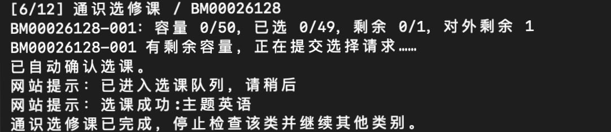

# BUAA Enroll

BUAA Enroll 是一个适配北京航空航天大学当前选课系统的 Chrome 自动化工具。它可以按配置顺序查询课程余量，并在符合条件时提交普通选课请求。

> [!IMPORTANT]
> 本项目仅供学习与个人使用。使用前请确认符合学校选课规则和系统使用要求；使用者需自行承担由脚本操作产生的结果。

## 功能

- 驱动 Chrome 操作现行选课网站，不依赖教务系统接口。
- 按课程类别和配置顺序轮询多个候选课程。
- 可指定课序号，也可选择课程代码下任意有余量的教学班。
- 体育课按对内名额、其他课程按对外名额判断余量。
- 保留独立的 Chrome 会话，支持登录失效后重新认证。

## 环境要求

- Python 3.9 或更高版本
- Google Chrome
- 能够访问北航统一身份认证和选课系统的网络环境

Selenium 会自动管理与 Chrome 匹配的驱动，通常无需手动下载 ChromeDriver。

## 快速开始

1. 安装依赖：

   ```bash
   python -m pip install -r requirements.txt
   ```

2. 在项目根目录创建 `credentials.json`，填写统一身份认证使用的学号和密码：

   ```json
   {
     "username": "你的学号",
     "password": "你的密码"
   }
   ```

3. 在项目根目录创建 `config.json`，填写候选课程：

   ```json
   {
     "courses": [
       {
         "type": "培养方案外课程",
         "code": "COURSE_CODE",
         "serial": "001",
         "name": ""
       }
     ]
   }
   ```

4. 运行程序：

   ```bash
   python buaa_enroll.py
   ```

启动后会打开一个独立的 Chrome 窗口。程序会读取 `credentials.json` 并自动提交统一身份认证。

## 运行示例



## 课程配置

`config.json` 中的 `courses` 是按优先级排列的候选课程：

```json
{
  "courses": [
    {
      "type": "培养方案外课程",
      "code": "COURSE_CODE",
      "serial": "001",
      "name": "备注名称"
    },
    {
      "type": "通识选修课",
      "code": "ANOTHER_COURSE_CODE",
      "serial": null,
      "name": ""
    }
  ]
}
```

- `type`：选课网站中的课程菜单名称。
- `code`：课程代码。
- `serial`：课序号；设为 `null` 时检查该课程代码下的所有教学班。
- `name`：可选备注，仅用于运行时显示。

可直接使用的类别包括：`班级课表推荐课程`、`培养方案内课程`、`培养方案外课程`、`重修课程`、`英语课`、`体育课`、`通识选修课`、`科研课堂` 和 `全校课程查询`。也兼容旧版配置名称 `一般专业`、`核心专业`、`核心通识`、`一般通识` 和 `体育`。

同一类别中任意一门课程选中后，程序会停止检查该类别，继续处理其他尚未完成的类别。所有类别都完成后，程序自动退出。

### 运行参数

`settings` 可以省略；未填写的字段使用以下默认值：

| 字段 | 默认值 | 说明 |
| --- | ---: | --- |
| `retry_interval` | `2` | 相邻候选课程之间的等待秒数 |
| `page_reload_every` | `10` | 每多少轮完整刷新页面；`0` 表示不自动完整刷新 |
| `login_reminder_interval` | `300` | 等待登录时的提示间隔（秒） |
| `result_timeout` | `30` | 提交后等待明确结果的时间（秒）；超时会暂停并要求手动核对 |
| `keep_browser_open` | `false` | 程序结束后是否等待确认再关闭 Chrome |

时间参数必须是有限数值；`retry_interval` 可为 `0`，其他时间参数必须大于 `0`。`page_reload_every` 必须是非负整数。即使关闭定期刷新，离开选课页面后也会重新检查登录和轮次。

收到成功提示后，程序会重新查询对应教学班，仅在确认已选后完成该类别。排队超时、结果未知或选择后的页面状态无法确认时，会暂停自动处理，等待你在 Chrome 中核对结果后按回车退出。重新运行前，请确认上一笔请求已结束。

## 凭据安全

`credentials.json` 以明文保存学号和密码，仅保存在你的本地设备上。会话数据保存在 `.chrome-profile/` 中。如果系统要求验证码或二次认证，程序将无法自动登录。


## 命令行选项

```text
python buaa_enroll.py [--config PATH] [--credentials PATH] [--profile-dir PATH]
```

使用 `python buaa_enroll.py --help` 查看完整帮助。运行期间可随时按 `Ctrl+C` 停止。

## 限制

- 程序依赖选课网站当前的页面结构；网站更新后可能需要重新适配。
- 程序只会自动处理普通的选课确认
- 课程余量和最终选课结果以学校系统显示为准。
- 请使用合理的查询间隔，避免对服务器造成不必要的负载。

## 本地验证

本地回归测试使用 Python 标准库 `unittest`，无需真实登录或提交选课：

```bash
python -m unittest discover -s tests -v
```

## 项目结构

```text
.
├── buaa_enroll.py           # 主程序
├── config.json              # 课程与运行参数
├── credentials.json         # 统一身份认证凭据
├── Sample/
│   └── Sample.jpeg      # 选课成功截图
├── requirements.txt         # Python 依赖
├── tests/                   # 不连接选课网站的回归测试
└── LICENSE                  # MIT 许可证
```

## 许可证

本项目使用 [MIT License](LICENSE)。
